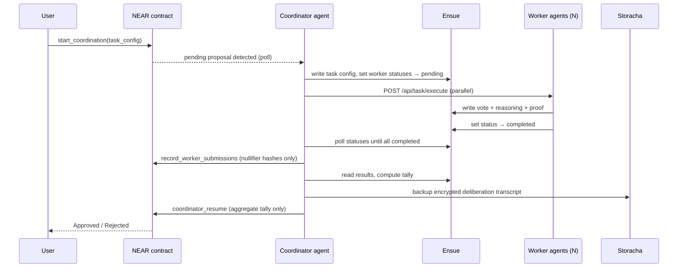

The coordinator agent is the orchestration layer of Delibera. It runs as an HTTP server (default port `3000`), polls the NEAR coordinator contract and Ensue shared memory for pending proposals, dispatches each proposal to all registered worker agents in parallel, waits for every worker to write its vote to Ensue, tallies the results, and finally calls `coordinator_resume` on-chain with only the aggregate tally — never individual votes or reasoning.

<Columns cols={2}>
  <Card title="Privacy-preserving" icon="lock">
    Individual worker votes and reasoning stay in Ensue. The coordinator only sends aggregate counts on-chain.
  </Card>
  <Card title="Dynamic discovery" icon="magnifying-glass">
    Workers are discovered from the NEAR registry contract at runtime. The `WORKERS` env var is a fallback for local mode.
  </Card>
  <Card title="Shade Agent v2" icon="shield">
    In production, the coordinator runs inside a Phala TEE and registers with the NEAR Shade Agent system before joining the coordination loop.
  </Card>
  <Card title="Tiered backup" icon="database">
    After each vote, the full deliberation transcript is encrypted with Lit Protocol and backed up to Storacha, then archived to Filecoin.
  </Card>
</Columns>

## Modes of operation

The coordinator has three startup modes, controlled by environment variables:

| Mode | Condition | Behavior |
|------|-----------|----------|
| `local` | `LOCAL_MODE=true` | Skips TEE registration, uses `startLocalCoordinationLoop()`. Trigger votes via `POST /api/coordinate/trigger`. |
| `production` | `AGENT_CONTRACT_ID`, `SPONSOR_ACCOUNT_ID`, and `SPONSOR_PRIVATE_KEY` are all set | Initialises `ShadeClient` v2, registers in the Phala TEE, polls the contract every 5 s for new proposals. |
| `degraded` | Neither of the above | HTTP server starts (health check only). On-chain coordination is disabled. |

<Note>
Set `LOCAL_MODE=true` during development. All coordination works end-to-end against the real NEAR testnet contract and Ensue, but the agent does not need to run inside a TEE.
</Note>

## Shade Agent v2 initialization

In production mode, the coordinator calls `ShadeClient.create()` with your sponsor account credentials. After the client initialises, it:

1. Checks the on-chain balance and tops up to 0.3 NEAR if the balance falls below 0.2 NEAR.
2. Polls the whitelist until the agent is registered.
3. Re-registers automatically every 6 days (TEE registration expires).
4. Registers the coordinator DID in the NEAR registry contract.
5. Starts the coordination polling loop at `POLL_INTERVAL` (default 5 s).

```typescript
const agent = await ShadeClient.create({
  networkId: 'testnet',
  agentContractId: process.env.AGENT_CONTRACT_ID,
  sponsor: {
    accountId: process.env.SPONSOR_ACCOUNT_ID,
    privateKey: process.env.SPONSOR_PRIVATE_KEY,
  },
  derivationPath: process.env.SPONSOR_PRIVATE_KEY,
});
```

## Coordination flow



## Environment variables

```bash
# Required
PORT=3000
ENSUE_API_KEY=your-ensue-api-key
ENSUE_TOKEN=your-ensue-token
NEXT_PUBLIC_contractId=coordinator.agents-coordinator.testnet

# Local mode
LOCAL_MODE=true
WORKERS=worker1:3001,worker2:3002,worker3:3003

# Production (Shade Agent v2)
AGENT_CONTRACT_ID=your-agent-contract.testnet
SPONSOR_ACCOUNT_ID=your-account.testnet
SPONSOR_PRIVATE_KEY=ed25519:...
NEAR_NETWORK=testnet
NEAR_ACCOUNT_ID=agents-coordinator.testnet
NEAR_SEED_PHRASE="your seed phrase here"

# Storacha (encrypted deliberation backup)
STORACHA_AGENT_PRIVATE_KEY=MgCZG7...
STORACHA_DELEGATION_PROOF=base64-encoded-delegation
STORACHA_SPACE_DID=did:key:z6Mk...

# Lit Protocol (threshold encryption)
LIT_NETWORK=datil

# Tuning
POLL_INTERVAL=5000
MIN_WORKERS=1
MAX_WORKERS=10
```

## HTTP API

### GET /

Health check. Returns the current mode and contract ID.

```bash
curl http://localhost:3000/
```

```json
{
  "message": "Coordinator Agent is running",
  "status": "healthy",
  "mode": "local",
  "contractId": "coordinator.agents-coordinator.testnet",
  "timestamp": "2026-03-17T10:00:00.000Z"
}
```

The `mode` field is one of `local`, `production`, or `degraded`.

---

### GET /api/coordinate/status

Returns the coordinator's current status, the active proposal ID, and the latest vote tally — all read from Ensue.

```bash
curl http://localhost:3000/api/coordinate/status
```

```json
{
  "status": "completed",
  "proposalId": 4,
  "tally": {
    "aggregatedValue": 3,
    "approved": 3,
    "rejected": 0,
    "decision": "Approved",
    "workerCount": 3,
    "timestamp": "2026-03-17T10:01:45.000Z"
  },
  "timestamp": "2026-03-17T10:01:46.000Z"
}
```

Possible `status` values: `idle`, `monitoring`, `recording_submissions`, `aggregating`, `resuming`, `completed`, `failed`.

---

### GET /api/coordinate/workers

Returns all registered worker statuses. When a registry is configured, the response includes each worker's DID, display name, endpoint URL, active flag, and Ensue status.

```bash
curl http://localhost:3000/api/coordinate/workers
```

```json
{
  "workers": [
    {
      "did": "did:key:z6MkAbc...",
      "display_name": "Worker Alpha",
      "endpoint_url": "http://localhost:3001",
      "is_active": true,
      "registered_at": 1742000000000,
      "ensue_status": "idle"
    }
  ],
  "source": "registry",
  "timestamp": "2026-03-17T10:00:00.000Z"
}
```

When the registry is unavailable, `source` is `env_fallback` and worker status is read solely from Ensue.

---

### POST /api/coordinate/trigger

Manually triggers a coordination round. The coordination runs in the background; the response returns immediately.

<ParamField body="taskConfig" type="object" required>
  Task configuration object.
</ParamField>

<ParamField body="taskConfig.type" type="string" required>
  Task type. Use `"vote"` for DAO proposal voting.
</ParamField>

<ParamField body="taskConfig.parameters.proposal" type="string">
  The proposal text for the agents to deliberate on (required when `type` is `"vote"`).
</ParamField>

<ParamField body="taskConfig.parameters.voting_config" type="object">
  Optional override for `min_workers` (integer) and `quorum` (integer, number of approvals required).
</ParamField>

<ParamField body="taskConfig.timeout" type="number">
  Timeout in milliseconds. Defaults to `30000`.
</ParamField>

```bash
curl -X POST http://localhost:3000/api/coordinate/trigger \
  -H 'Content-Type: application/json' \
  -d '{
    "taskConfig": {
      "type": "vote",
      "parameters": {
        "proposal": "Fund a developer grant program for 10,000 NEAR"
      },
      "timeout": 30000
    }
  }'
```

```json
{
  "message": "Coordination triggered",
  "taskConfig": "{\"type\":\"vote\",...}",
  "timestamp": "2026-03-17T10:00:00.000Z"
}
```

---

### POST /api/coordinate/reset

Clears all Ensue coordination memory and resets worker statuses to `idle`. Use this during development to start a clean vote.

<Warning>
This deletes all in-flight state from Ensue. Do not call this while a vote is in progress.
</Warning>

```bash
curl -X POST http://localhost:3000/api/coordinate/reset
```

```json
{
  "message": "Memory reset complete",
  "timestamp": "2026-03-17T10:00:00.000Z"
}
```

---

### GET /api/coordinate/proposals

Lists all archived proposals from Ensue. Optionally filter by worker DID.

<ParamField query="workerDid" type="string">
  Filter to proposals where this worker participated.
</ParamField>

```bash
curl http://localhost:3000/api/coordinate/proposals

# Filter by worker
curl 'http://localhost:3000/api/coordinate/proposals?workerDid=did:key:z6MkAbc...'
```

```json
{
  "proposals": [
    {
      "proposalId": "4",
      "status": "completed",
      "decision": "Approved",
      "approved": 3,
      "rejected": 0,
      "workerCount": 3,
      "timestamp": "2026-03-17T10:01:45.000Z"
    }
  ],
  "total": 1
}
```

---

### GET /api/coordinate/proposals/:id

Returns full details for a single proposal, including the per-worker results stored in Ensue.

<ParamField path="id" type="string" required>
  The proposal ID (numeric string).
</ParamField>

```bash
curl http://localhost:3000/api/coordinate/proposals/4
```

```json
{
  "proposalId": "4",
  "status": "completed",
  "config": { "type": "vote", "parameters": { "proposal": "Fund a grant..." } },
  "tally": {
    "aggregatedValue": 3,
    "approved": 3,
    "rejected": 0,
    "decision": "Approved",
    "workerCount": 3,
    "timestamp": "2026-03-17T10:01:45.000Z"
  },
  "workers": {
    "did:key:z6MkAbc...": {
      "result": { "vote": "Approved", "reasoning": "..." },
      "timestamp": "2026-03-17T10:01:30.000Z"
    }
  }
}
```

---

### POST /api/coordinate/select-jury

Selects a jury from a candidate pool using Flow VRF. The same seed always produces the same jury, making selection verifiable and auditable.

<ParamField body="pool" type="string[]" required>
  Array of candidate NEAR account IDs.
</ParamField>

<ParamField body="jurySize" type="number">
  Number of jurors to select. Defaults to `3`.
</ParamField>

<ParamField body="deliberationId" type="string">
  Optional context ID for the deliberation.
</ParamField>

```bash
curl -X POST http://localhost:3000/api/coordinate/select-jury \
  -H 'Content-Type: application/json' \
  -d '{
    "pool": ["alice.near", "bob.near", "carol.near", "dave.near", "eve.near"],
    "jurySize": 3,
    "deliberationId": "proposal-4"
  }'
```

```json
{
  "jury": ["carol.near", "alice.near", "eve.near"],
  "vrfSeed": "123456789",
  "vrfProof": "flow-testnet:0xabc..."
}
```

---

### POST /api/coordinate/verify-jury

Verifies that a given VRF seed deterministically produces the expected jury.

<ParamField body="pool" type="string[]" required>
  The original candidate pool.
</ParamField>

<ParamField body="jurySize" type="number" required>
  The original jury size.
</ParamField>

<ParamField body="vrfSeed" type="string" required>
  The VRF seed to verify.
</ParamField>

```bash
curl -X POST http://localhost:3000/api/coordinate/verify-jury \
  -H 'Content-Type: application/json' \
  -d '{
    "pool": ["alice.near", "bob.near", "carol.near", "dave.near", "eve.near"],
    "jurySize": 3,
    "vrfSeed": "123456789"
  }'
```

```json
{
  "jury": ["carol.near", "alice.near", "eve.near"],
  "vrfSeed": "123456789",
  "verified": true,
  "timestamp": "2026-03-17T10:00:00.000Z"
}
```

---

### PATCH /api/coordinate/workers/:did/name

Sets or updates a worker's human-readable display name. The name is stored in Ensue at `agent/{did}/display_name` and returned alongside the DID in the `/workers` and `/proposals/:id` endpoints.

<ParamField path="did" type="string" required>
  The worker's `did:key` identifier (URL-encoded).
</ParamField>

<ParamField body="name" type="string" required>
  The display name to assign. Must be at least 1 character.
</ParamField>

```bash
curl -X PATCH \
  'http://localhost:3000/api/coordinate/workers/did%3Akey%3Az6MkAbc.../name' \
  -H 'Content-Type: application/json' \
  -d '{"name": "Worker Alpha"}'
```

```json
{
  "did": "did:key:z6MkAbc...",
  "name": "Worker Alpha",
  "status": "updated"
}
```

<Tip>
URL-encode the `did` path parameter. The colon and forward-slash characters in `did:key:z6Mk...` must be percent-encoded as `%3A` and `%2F` respectively.
</Tip>
