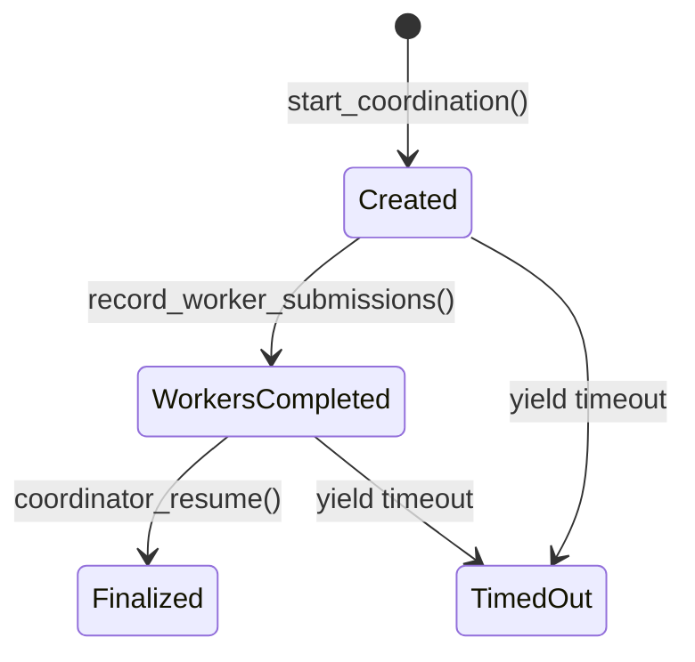

The coordinator contract is the on-chain backbone of Delibera. It stores the DAO manifesto, manages proposal state via the NEAR yield/resume pattern, records worker submission nullifiers, and finalises aggregate tallies — all without ever receiving individual votes or AI reasoning.

**Deployed at:** `coordinator.agents-coordinator.testnet`

**Owner:** `agents-coordinator.testnet`

<Columns cols={2}>
  <Card title="Yield/resume" icon="arrows-rotate">
    Each proposal creates a NEAR yielded promise that pauses execution. The coordinator agent resumes it with the aggregate result when voting is complete.
  </Card>
  <Card title="Nullifier pattern" icon="fingerprint">
    Worker submissions record only `worker_id` and `result_hash` on-chain. Individual votes stay private in Ensue.
  </Card>
  <Card title="Codehash approval" icon="shield-check">
    Only coordinator agents with an owner-approved codehash can call `record_worker_submissions` or `coordinator_resume`. This prevents rogue agents from settling fake results.
  </Card>
  <Card title="Proposal lifecycle" icon="list-check">
    Proposals move through four states: `Created` → `WorkersCompleted` → `Finalized` (or `TimedOut`).
  </Card>
</Columns>

## Proposal lifecycle



### ProposalState enum

| State | Description |
|-------|-------------|
| `Created` | Proposal created, yield active, waiting for workers to vote. |
| `WorkersCompleted` | All worker submission hashes recorded on-chain. |
| `Finalized` | Coordinator resumed the yield with the aggregate tally. |
| `TimedOut` | The NEAR yield timer expired before the coordinator could resume. |

## Yield/resume pattern

When `start_coordination` is called, the contract uses `env::promise_yield_create` to suspend execution and return a `yield_id`. The coordinator agent polls for proposals in `Created` state, processes them off-chain, and then calls `coordinator_resume` with the aggregated result. This call uses `env::promise_yield_resume` to wake the suspended promise and deliver the result.

This pattern allows the NEAR contract to "wait" for an off-chain multi-agent computation without blocking the blockchain.

<Note>
The yield timeout is controlled by NEAR protocol parameters. If the coordinator agent fails to resume before the timeout, the proposal moves to `TimedOut` state and the `fail_on_timeout` callback panics the promise.
</Note>

## Nullifier pattern for worker submissions

The `record_worker_submissions` method accepts an array of `{ worker_id, result_hash }` pairs. The `result_hash` is a SHA-256 of the full `WorkerResult` JSON stored in Ensue. This creates an on-chain proof of participation (a nullifier) without revealing any vote data.

The contract enforces that:
- The number of submissions matches `expected_worker_count`.
- Each `worker_id` can only submit once per proposal (double-submission is rejected).

## Codehash approval system

Before any coordinator agent can settle results on-chain, the contract owner must approve its codehash:

```bash
# 1. Owner approves the coordinator's codehash (sha256 of the WASM binary)
near call coordinator.agents-coordinator.testnet approve_codehash \
  '{"codehash": "abc123..."}' \
  --accountId agents-coordinator.testnet

# 2. Coordinator registers itself
near call coordinator.agents-coordinator.testnet register_coordinator \
  '{"checksum": "sha256:abc123...", "codehash": "abc123..."}' \
  --accountId coordinator-agent.testnet
```

After registration, the coordinator's account ID is stored in `coordinator_by_account_id`. The `require_approved_codehash` guard on `record_worker_submissions` and `coordinator_resume` verifies that the caller is in this map and that the codehash is still in the approved set.

## Contract methods

### new

Initialises the contract. Called once at deployment.

<ParamField body="owner" type="AccountId" required>
  The NEAR account that owns the contract and can approve codehashes, set the manifesto, and register coordinators.
</ParamField>

```bash
near deploy coordinator.agents-coordinator.testnet \
  --initFunction new \
  --initArgs '{"owner": "agents-coordinator.testnet"}'
```

---

### set_manifesto

Sets or updates the DAO manifesto. Owner only. The manifesto text is stored on-chain and read by worker agents before each vote.

<ParamField body="manifesto_text" type="string" required>
  The manifesto text. Maximum 10,000 characters. A SHA-256 hash is computed and stored alongside the text.
</ParamField>

```bash
near call coordinator.agents-coordinator.testnet set_manifesto \
  '{"manifesto_text": "We govern this DAO to maximise long-term value for all stakeholders..."}' \
  --accountId agents-coordinator.testnet
```

<Warning>
The manifesto must be set before any proposals can be created. `start_coordination` panics if no manifesto exists.
</Warning>

---

### get_manifesto

View function. Returns the current manifesto text and its SHA-256 hash.

```bash
near view coordinator.agents-coordinator.testnet get_manifesto '{}'
```

```json
{
  "text": "We govern this DAO to maximise long-term value...",
  "hash": "a3f8c2d1..."
}
```

---

### start_coordination

Creates a new proposal and a NEAR yielded promise. Returns the `proposal_id`.

<ParamField body="task_config" type="string" required>
  JSON string describing the task. Maximum 10,000 characters. Example: `'{"type":"vote","parameters":{"proposal":"Fund a grant"}}'`.
</ParamField>

<ParamField body="expected_worker_count" type="u8" required>
  The number of worker submissions expected for this proposal. `record_worker_submissions` enforces this count exactly.
</ParamField>

<ParamField body="quorum" type="u8" required>
  Minimum number of `Approved` votes needed to pass. `0` means the coordinator's default majority logic applies.
</ParamField>

```bash
near call coordinator.agents-coordinator.testnet start_coordination \
  '{
    "task_config": "{\"type\":\"vote\",\"parameters\":{\"proposal\":\"Fund a grant for 5,000 NEAR\"}}",
    "expected_worker_count": 3,
    "quorum": 2
  }' \
  --accountId your-account.testnet
```

---

### record_worker_submissions

Records worker submission nullifiers on-chain. Moves the proposal from `Created` to `WorkersCompleted`. Requires an approved coordinator codehash.

<ParamField body="proposal_id" type="u64" required>
  The proposal ID returned by `start_coordination`.
</ParamField>

<ParamField body="submissions" type="WorkerSubmissionInput[]" required>
  Array of `{ worker_id: string, result_hash: string }` objects. The array length must equal `expected_worker_count`.
</ParamField>

```bash
near call coordinator.agents-coordinator.testnet record_worker_submissions \
  '{
    "proposal_id": 4,
    "submissions": [
      {"worker_id": "did:key:z6MkA...", "result_hash": "e3b0c4..."},
      {"worker_id": "did:key:z6MkB...", "result_hash": "f4c1d5..."},
      {"worker_id": "did:key:z6MkC...", "result_hash": "a2b9e7..."}
    ]
  }' \
  --accountId coordinator-agent.testnet
```

---

### coordinator_resume

Settles the proposal on-chain with the aggregate tally. Resumes the NEAR yield. Requires an approved coordinator codehash.

<ParamField body="proposal_id" type="u64" required>
  The proposal ID to resume.
</ParamField>

<ParamField body="aggregated_result" type="string" required>
  JSON string of the `OnChainResult` (aggregate counts only — no individual worker data).
</ParamField>

<ParamField body="config_hash" type="string" required>
  SHA-256 of the original `task_config`. Must match the hash stored at proposal creation time.
</ParamField>

<ParamField body="result_hash" type="string" required>
  SHA-256 of `aggregated_result`. Verified on-chain for result integrity.
</ParamField>

```bash
near call coordinator.agents-coordinator.testnet coordinator_resume \
  '{
    "proposal_id": 4,
    "aggregated_result": "{\"approved\":3,\"rejected\":0,\"decision\":\"Approved\",\"workerCount\":3}",
    "config_hash": "a3f8c2...",
    "result_hash": "b7d4e1..."
  }' \
  --accountId coordinator-agent.testnet
```

---

### get_proposal

View function. Returns a single proposal by ID.

<ParamField body="proposal_id" type="u64" required>
  The proposal ID.
</ParamField>

```bash
near view coordinator.agents-coordinator.testnet get_proposal '{"proposal_id": 4}'
```

---

### get_all_proposals

View function. Returns all proposals with optional pagination.

<ParamField body="from_index" type="u64">
  Start from this proposal ID (inclusive). Defaults to `0`.
</ParamField>

<ParamField body="limit" type="u64">
  Maximum number of proposals to return. Defaults to all.
</ParamField>

```bash
near view coordinator.agents-coordinator.testnet get_all_proposals \
  '{"from_index": 0, "limit": 10}'
```

---

### get_proposals_by_state

View function. Returns proposals filtered by lifecycle state.

<ParamField body="state" type="ProposalState" required>
  One of `"Created"`, `"WorkersCompleted"`, `"Finalized"`, or `"TimedOut"`.
</ParamField>

<ParamField body="from_index" type="u64">
  Pagination start.
</ParamField>

<ParamField body="limit" type="u64">
  Pagination limit.
</ParamField>

```bash
near view coordinator.agents-coordinator.testnet get_proposals_by_state \
  '{"state": "Finalized", "limit": 5}'
```

---

### get_pending_coordinations

View function. Returns all proposals in `Created` state (i.e., waiting for the coordinator to process them). The coordinator agent polls this method every 5 s in production mode.

```bash
near view coordinator.agents-coordinator.testnet get_pending_coordinations '{}'
```

---

### get_finalized_coordination

View function. Returns the `finalized_result` JSON string for a proposal in `Finalized` state, or `null` if not yet finalised.

<ParamField body="proposal_id" type="u64" required>
  The proposal ID.
</ParamField>

```bash
near view coordinator.agents-coordinator.testnet get_finalized_coordination \
  '{"proposal_id": 4}'
```

---

### register_worker

Registers a worker agent that can participate in governance voting. Only the contract owner or a registered coordinator can call this.

<ParamField body="worker_id" type="string" required>
  The worker's identifier (typically its `did:key`).
</ParamField>

<ParamField body="account_id" type="AccountId">
  Optional NEAR account ID to associate with the worker.
</ParamField>

```bash
near call coordinator.agents-coordinator.testnet register_worker \
  '{"worker_id": "did:key:z6MkAbc...", "account_id": "worker1.testnet"}' \
  --accountId agents-coordinator.testnet
```

---

### approve_codehash

Approves a coordinator codehash. Owner only. Must be called before `register_coordinator`.

<ParamField body="codehash" type="string" required>
  The SHA-256 hash of the coordinator agent's WASM or container image.
</ParamField>

```bash
near call coordinator.agents-coordinator.testnet approve_codehash \
  '{"codehash": "abc123def456..."}' \
  --accountId agents-coordinator.testnet
```

---

### register_coordinator

Registers a coordinator agent. Owner only. The `codehash` must already be in the approved set.

<ParamField body="checksum" type="string" required>
  A checksum string for the coordinator build (e.g., `sha256:abc123...`).
</ParamField>

<ParamField body="codehash" type="string" required>
  The codehash to associate with the caller's account. Must be in the approved set.
</ParamField>

```bash
near call coordinator.agents-coordinator.testnet register_coordinator \
  '{"checksum": "sha256:abc123...", "codehash": "abc123..."}' \
  --accountId coordinator-agent.testnet
```
